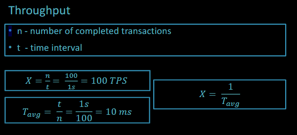
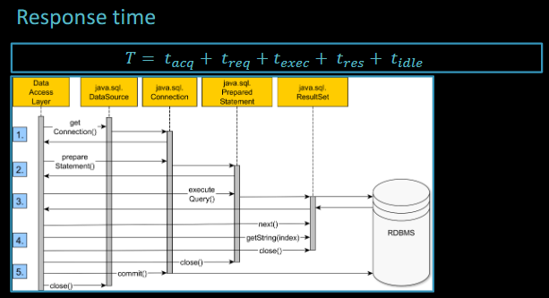
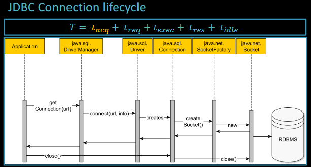
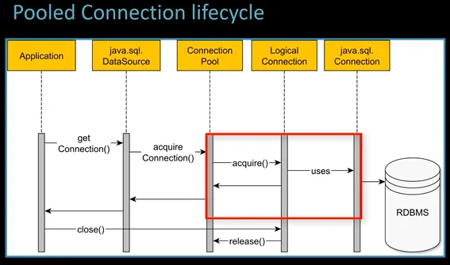
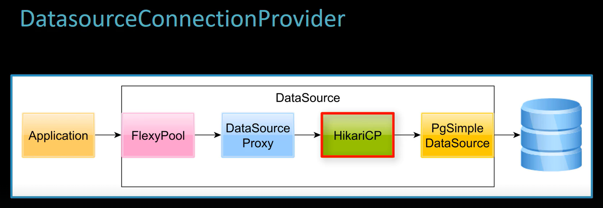

# Connections

The throughput X is considered and the number of transactions per second and its reciprocal T_avg is the average response time

The response time is a combination of several factors:

- acquire database connection
- statement submission to the database engine
- statements execution time
- resultset fetching
- closing transactions and releasing the connection

The most demanding operation is connection acquisition. The JDBC driver manager acts as a factory of physical database connection; when the application asks for a new connection from the driver, a socket is opened and a TCP connection is established between the JDBC client and the database server (the DB will allocate a thread or a process). 

This is why we use connection pools like HikariCP which leave the physical connection open while serving pool connections that can be reused with a small overhead. Even closing a connection pool is not an expensive operation.

Hibernate DatasourceConnectionProvider is the best choice among the connection pool providers since it offers the best control over the DataSource configuration, it supports JTA transactions (for Java EE projects), it can have as many proxies as we want chained (like FlexyPool for monitoring), supports also connections pool not supported natively by hibernate. What Hibernate sees is just a decorated Datasource.

