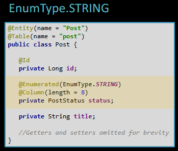
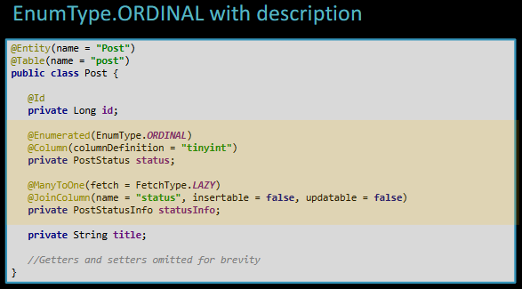
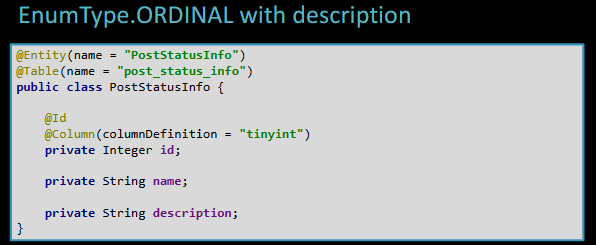
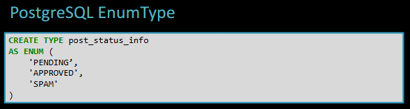
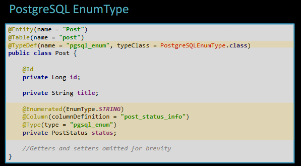
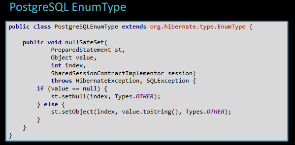

# EnumType

An EnumType can be mapped to a database column in 3 ways:

- Using JPA `@Enumerated` annotation:
    - with `EnumType.STRING` by which the enum is stored as a string. The string representation occupies more bits but it is human-readable
        
    
        
    - with `EnumType.ORDINAL` by which the enum is stored as an int representing the literal value. The ordinal representation saves bites but, for a service consuming this data, it doesn’t give any way to interpret the data without a decoding table. If we know the enum to have less than 256 values we can use a tinyint. To map the decoding table post_status_info we need a `@ManyToOne`association on the table containing the enum column, specifying that the item cannot be inserted or updated since we don't want to have two owner of the same data
    
    
    
    
    
- Creating a custom type (if the db vendor permits it) like the PostgreSQL EnumType, by which the database will be able to store the string value of the enum while reducing the space required in comparison to the varchar implementation required in EnumType.STRING
    
    
    
    Since Hibernate is not aware of the custom enum type we need to explicitly state its definition programmatically
    
    
    
    And create a custom class that extends the default Hibernate EnumType, overriding the nullSafeSet method that is responsible for binding the enum type as a jdbc-prepared statement parameter
    
    
    
