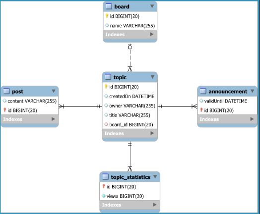
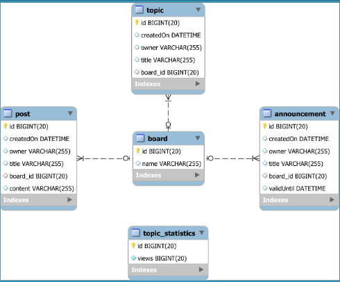

# JPA inheritance

Inheritance is a common paradigm in OOP to vary the behavior of a super-class (interface) depending on its subclasses'
implementation. With JPA inheritance we can implement behavioral design pattern such as the **Strategy Pattern** to
varying the business logic independently by the underlying database table.

In general, in a RDBMS, inheritance can only be emulated through table relationships

Martin Fowler design patter for RDBMS inheritance:

* **Single Table inheritance**: a single database table is used to represent all classes in a given inheritance
  hierarchy
* **Class Table inheritance**: the parent class and each subclass are mapped to separate tables related by the foreign
  key
  on the base class; the subclasses tables contains only the fields that are not in the parent class table.
* **Concrete Table inheritance**: each table in the hierarchy defines all attributes

JPA inheritance mapping models:

* `InheritanceType.SINGLE_TABLE`
* `InheritanceType.JOINED`
* `InheritanceType.TABLE_PER_CLASS`
* `@MappedSuperclass` (inheritance is available only in the Domain Model without being mirrored in the database)

## Single table inheritance


Pros: query efficiency, since we have one single table to query

Cons: data integrity; we are not respecting the consistency principle of ACID since we can enforce non-nullability on
the application level (on the entities) but not on the persistence layer (since a single table represents more than one
entity there will be fields that are always null for one child entity but not the other, hence nullability can't be
constrained on the persistence layer). The only alternative is to use DB specifics constrain like CHECK (PostgreSQL) or
TRIGGER (MySQL)

### `@DiscriminatorColumn` and `@DiscriminatorValue`

When using single table inheritance, by default JPA use a discriminator column of type `String` called `DTYPE` to
differentiate the child entities of the single table with a discriminator value equal to the entity classes name.
However, this is not the only option since we can choose to use a custom string or opt to a char or an int. We only need
to annotate the parent entity with the `@DiscriminatorColumn`annotation specifying the type and the name of the column,
and then annotates all the child entities with the `@DiscriminatorValue`.

```java

@DiscriminatorColumn(
        discriminatorType = DiscriminatorType.STRING,
        name = "topic_type_id",
        columnDefinition = "VARCHAR(3)"
)
@DiscriminatorValue("TPC")
public class Topic {
    // ....
}
```

## Joined inheritance



Pros: Explicit representation of the child entities and consistency in nullability

Cons: Expensive polymorphic queries due to the number of join

In the joined inheritance, the child entities have an explicit table that contains their specific properties while the
common attributes are defined in the parent table; child and parent entity share the same id column.
As a direct consequence, an insert of child entity requires the execution of two insert statements, one for the parent
and one for the child entity. While in single inheritance we have a single index (a single pkey) shared between parent
and child entities, the explicit child table representation requires the presence of more indexes. In contrast, joined
inheritance allows for consistency since we can respect nullability in subclasses both on the application and on the
persistence layer. Polymorphic queries are also more expensive since hibernate needs to resolve all the possible
subclasses of the parent entity, leading to N + 1 joins where N is the number of subclasses, leading to a suboptimal
execution plan.

## Table per class



N.B. Identity generation strategy is not allowed since it can't guarantee unique identifier between parent and children
entities and this will generate conflicts in polymorphic queries which needs a way to provide unique results

Pros: Write operation are faster since we are inserting only once in the specific subclass

Cons: Polymorphic queries use hibernate `UNION ALL` in inner queries and therefore are very inefficient; besides, not
all hibernates dialect support UNION ALL and fall back to UNION which adds a sorting phase to eliminate duplicates,
something that is redundant since polymorphic queries cannot contain duplicates since the entity identifier and the
discriminator column provides unique results in the inheritance tree.

In the table per class inheritance, the child entities contain all the fields that are shared with the parent entity
plus their specifics ones. There is no foreign key neither between parent and children.