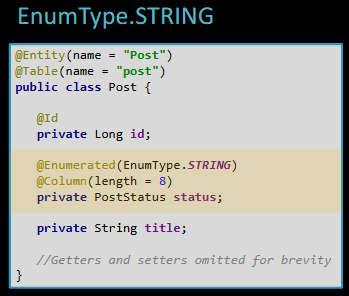
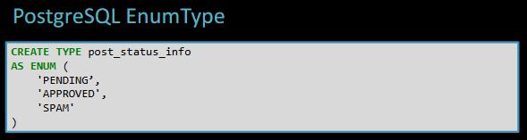
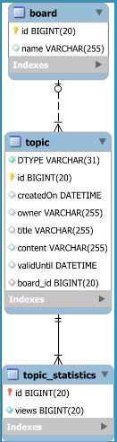

<H1>Java Persistence Theory</H1>

<!-- TOC -->
* [Connections](#connections)
* [Primary Keys and JPA identifiers](#primary-keys-and-jpa-identifiers)
* [JPA identifiers](#jpa-identifiers)
* [Entity Relationship](#entity-relationship)
  * [`@ManyToOne`](#manytoone)
    * [bidirectional](#bidirectional)
  * [Unidirectional `@OneToMany`](#unidirectional-onetomany)
    * [join table](#join-table)
      * [List vs Set Collections](#list-vs-set-collections)
    * [`@JoinColumn`](#joincolumn)
  * [`@OneToOne`](#onetoone)
    * [unidirectional](#unidirectional)
    * [bidirectional](#bidirectional-1)
  * [`@ManyToMany`](#manytomany)
    * [Explicit mapping](#explicit-mapping)
* [EnumType](#enumtype)
* [JPA inheritance](#jpa-inheritance)
  * [Single table inheritance](#single-table-inheritance)
    * [`@DiscriminatorColumn` and `@DiscriminatorValue`](#discriminatorcolumn-and-discriminatorvalue)
  * [Joined inheritance](#joined-inheritance)
  * [Table per class](#table-per-class)
  * [`@MappedSuperclass`](#mappedsuperclass)
<!-- TOC -->

# Connections


The throughput X is considered and the number of transactions per second and its reciprocal T_avg is the average response time


The response time is a combination of several factors:

- acquire database connection
- statement submission to the database engine
- statements execution time
- resultset fetching
- closing transactions and releasing the connection


The most demanding operation is connection acquisition. The JDBC driver manager acts as a factory of physical database connection; when the application asks for a new connection from the driver, a socket is opened and a TCP connection is established between the JDBC client and the database server (the DB will allocate a thread or a process).


This is why we use connection pools like HikariCP which leave the physical connection open while serving pool connections that can be reused with a small overhead. Even closing a connection pool is not an expensive operation.


Hibernate DatasourceConnectionProvider is the best choice among the connection pool providers since it offers the best control over the DataSource configuration, it supports JTA transactions (for Java EE projects), it can have as many proxies as we want chained (like FlexyPool for monitoring), supports also connections pool not supported natively by hibernate. What Hibernate sees is just a decorated Datasource.


# Primary Keys and JPA identifiers

Primary keys are the unique identifier of a row in a table.

We can choose between a **natural ID**, i.e. a unique identifier naturally related to the entity we are storing, like a
social security number or a book ISBN. Natural identifiers are usually not the best choice due to their space overhead (
to be unique they are generally long).

The most common option is a **surrogate key**, i.e. a generic unique identifier. We can choose from:

- UUID (128bits)
- Auto-increment column (from 8 to 64bits at max if we use long)

The dimension of the primary key and the efficiency of its associated index; b-trees are self-balancing tree data
structures at the core of relational databases and they work better with sequential indexes because a new index is
always appended at the end of the clustered index hence the physical ordering will match the logical ordering resulting
in an optimal key-set pagination (searching for a range of primary keys) since we will have sequential reads. If the key
is generated randomly we will have fragmentation and page splits leading to more I/O operations.

# JPA identifiers

In JPA and Hibernate each entity requires an identifier for the primary key mapping. It can be manually assigned (using
only the `@Id`, annotation don’t do this) or generated by the provider with 3 different strategies:

- Identity → `GenerationType.IDENTITY`, using the physical database identity column. The identity generator can be
  applied only to a single column; An internal counter is incremented every time it is invoked using a lightweight
  locking mechanism that is not transactional (i.e **rollbacks can lead to gaps in the identity column values of two
  consecutive columns rows**) and can release the lock right away after the increment.
  **DRAWBACKS:**
  The new value assigned from the counter is known only after executing the INSERT statement.
  Since the ID generation and the insert statement occur in a different transaction, Hibernate disables the batch
  insert. Hibernate issues the insert statement during the persist method call without waiting for the first-level
  cache (i.e. the Persistence Context) to flush and synchronize the entity state changes with the database.
- Sequence → `GenerationType.SEQUENCE`, using a sequence generator. A Sequence is a database object that generates a
  number upon incrementing an internal counter, and this can be done by incremental steps, allowing for
  application-level optimization techniques (like caching strategy to preallocate a set of values reducing the number of
  database round trip). The sequence call can be decoupled from the insert statement, allowing for batch insert.
  Like Identity columns, sequences use lightweight locks (released right after the increment operation) to prevent
  concurrent transactions from acquiring the same value, but since sequence increments are not transactional, gaps can
  be found in the primary key value of consecutive rows (not a bug).
- Table → `GenerationType.TABLE` (**DON’T USE IT,** best to use identity if sequences are not supported), to emulate
  a database sequence using a separate table (for database vendors that do not support sequences) with a low-level
  lock (row-level locking) that is transactional and requires the whole insert transaction to commit or rollback. An
  alternative is to have a separate transaction handling the value generation, but this requires a separate database
  connection

# Entity Relationship

## `@ManyToOne`

The `@ManyToOne` mapping is the most natural way to map a foreign key relationship between a parent and a child entity.
The annotation is placed on the child entity, usually with a LAZY behavior and optionally with a `@JoinColum` (mandatory
only if we use different naming in the entities' variables)

```java

@ManyToOne(fetch = FetchType.LAZY)
@JoinColumn(name = "post_id")
private Post post;
```

### bidirectional

If we need the relationship to be **bidirectional**, the parent entity must be hold a collection of the child entity
annotated with `@OneToMany`, specifying the mapping to the child variable holding the reference, the cascade type and
the
orphan removal strategy (usually, if the entities are strongly tied, the cascade type is set to ALL and the orphan
removal to true). Moreover, even if it is the child-side responsibility to sync the association, it is common to have
utility methods to synchronize both sides of the relationship if used in a `@Transactional` method.

```java

@OneToMany(
        mappedBy = Comment_.POST,
        cascade = CascadeType.ALL,
        orphanRemoval = true)
private List<Comment> comments = new ArrayList<>();

public void addComment(Comment comment) {
    comments.add(comment);
    comment.post(this);
}

public void removeComment(Comment comment) {
    comments.remove(comment);
    comment.post(null);
}
```

In this way, the removal of a comment is efficient since executes only one DELETE statement and remove the reference
from the Comment object so that it can be garbage collected.

## Unidirectional `@OneToMany`
(DON'T USE IT IF YOU CAN)

Even if uncommon, we might opt to hold a unidirectional reference only on the parent-side of the relationship.
Its performance depends on the implementation and on the type of collection we implement, but always worse (less
performant) than a bidirectional one.

### join table

One solution would be to have a join table acting as collector of the parent-child relationship, however this means to
have an extra table with two foreign keys (and most probably two indexes) instead of only one on the child side.

To map the collection on the parent-side we can use either a `Set` or a `List`

#### List vs Set Collections

While inserting elements in the two collections require the same effort, when coming to the remove of an element,
`Lists` are inefficients since they require the join table to remove all the rows associated with the id of the parent
entity to then re-add all the parent-child association rows except the one associated with the child entity we were
removing from the collection. To this, it must be added a re-balancing of the indexes in the join table two times, first
when the rows are removed, and then we are re-added.

If there is a meaning of ordering in the join column we could use the `List` collection together with the `@OrderColumn`
annotation to reduce the burden of using lists; in this way, if we want to remove the last element only two delete
statement are executed, one for the join table and one for the child table. However, if we are not removing the last
element, hibernate will execute an update statement for each row that will be shifted.

### `@JoinColumn`

An alternative, that requires the child-entity to hold a reference to the parent, is to annotate the parent-side
collection with the `@JoinColumn` annotation. However, this approach is also inefficient since for persisting elements
in the parent side collection hibernate will have to issue and insert statement and an update for each element
persisted. The update is required since the child entity is flushed before the parent-side collection, therefore,
hibernate has no clue about the foreign key value, hence an update is required to set the foreign key. If the option
`nullable=false` is specified in the `@JoinColumn` annotation, hibernate will flush the child entity with the foreign
key populated, but it will issue an update statement anyway.

Similarly, deleting an element from the parent-side collection has bad performance if the `nullable=false` is not set,
hibernate will first fire an update statement on the child entity to set the foreign key value to null, and only after
is will issue the delete statement to remove that same child entity. If `nullable=false` we save the first useless
update statement.

## `@OneToOne`

### unidirectional

The one-to-one unidirectional relationship can be mapped in two ways, with a `@JoinColumn` or with a `@MapsId`
annotation. In the first case we would need two indexes on the child table, one for its primary key and one for the
foreign key pointing to the parent entity.

With `@MapsId` we have several advantages, parent and child table shares the same primary key, therefore, even if the
relation is unidirectional (from the child side) we can access the parent or the child knowing one id; the indexes on
the child side are reduced to one.

### bidirectional

If it is required to access the child entity even from the parent side, a `@OneToOne` annotation is required on the
parent-side. However, there is the possibility of incurring in an N+1 performance bottleneck: in fact, since hibernate
needs to know if assign a null value or an object to the one-to-one mapping, a select query is performed for each post
entity retrieved in order to check, and eventually find, if there is a child entity connected.

Therefore, is a query like the following executed, n+1 queries are executed!

```java

@Query(value = """
        select * from post p
        where p.title like :title
        """, nativeQuery = true)
List<Post> findPostsWhereTitleIn(@Param("title") String title);
```

## `@ManyToMany`

In a many-to-many relationship, each side of the relation act as a parent-side, while the join table can be considered
as the child. The association can be either unidirectional or bidirectional, depending on the fact that we might need to
access the collection from both sides. However, in JPA terms, even in a bidirectional mapping, only one side will be
responsible to synchronize the mapping. Due to the parent-to-parent relation, the cascade type is confined to `PERSIST`
and `MERGE` operations, since none of the sides owns the other and, therefore, has no means to determine a cascade
delete for example. Furthermore, in the case of a bidirectional mapping, cascade delete would have catastrophic
consequence, since the deleting will be ping-ponged between the two entity, resulting in the complete deletion of all
records.

As for a unidirectional `@OneToMany` association there is a difference in the behavior triggered by the underling
collection type; as a matter of fact, while Lists and Sets behave equally for insertion, upon deletion Lists will first
remove all the rows associated with the id of the entity owner of the collection, to then reinsert all the rows but the
one that actually we wanted to remove. Sets instead execute a punctual delete on the row of the join table.

Usually, the join table is not modelled explicitly but embedded in one of the two parent-side with the `@JoinTable`
annotation

```java

@ManyToMany(cascade = {CascadeType.PERSIST, CascadeType.MERGE})
@JoinTable(
        name = "post_tag",
        joinColumns = @JoinColumn(name = "post_id"),
        inverseJoinColumns = @JoinColumn(name = "tag_id"))
private Set<Tag> tags = new HashSet<>();
```

### Explicit mapping

The join table can also be explicitly mapped into an entity; in this case the relation between the two parent-side
becomes like a bidirectional `@OneToMany` mapping, and the use of cascade type ALL is possible since the two parent
entity doesn't speak directly one to another but only through the join table entity acting now as a child to both the
ends.

The join table can now contain more attributes than merely the two ids; the combined primary key, composed by the two
ids of the parents entities, id defined as an `@Embeddable`. The join table entity has therefore an `@EmbeddedId` and at
least two fields with a `@ManyToOne` annotation, pointing to the parents collections and with the `@MapsId` annotation,
delegating the foreign key reference to the embeddable type.

```java

@Entity
@Table(name = "post_tag")
class PostTag {

    public PostTag(Post post, Tag tag) {
        this.post = post;
        this.tag = tag;
        this.id = new PostTagId(post().id(), tag.id());
    }

    @EmbeddedId
    private PostTagId id;

    @ManyToOne
    @MapsId(PostTagId_.POST_ID)
    private Post post;

    @ManyToOne
    @MapsId(PostTagId_.TAG_ID)
    private Tag tag;

}

@Embeddable
record PostTagId(@Column(name = "post_id")
                 Long postId,
                 @Column(name = "tag_id")
                 Long tagId) {
}
```

From the parents side, we now have a collections of the new child entity, and we can use List without incurring in the
hibernate bag behavior seen in the unidirectional `@OnetoMany` mapping (i.e. we have a single delete statement instead
of a deleted all of n records where id = my_id and a n-1 insert back). The synchronization methods are again useful on
the parent side, even if their implementation is a bit more cumbersome since we need to keep in sync both ends of the
many-to-many association.

```java
public void addTag(Tag tag) {
    PostTag postTag = new PostTag(this, tag);
    tags.add(postTag);
    tag.posts().add(postTag);
}

public Post removeTag(Tag tag) {
    tags.stream().filter(t -> t.post().equals(this) && t.tag().equals(tag))
            .findFirst()
            .ifPresent(t -> {
                tags.remove(t);
                t.tag().posts().remove(t);
                t.post(null);
                t.tag(null);
            });
    return this;
}
```

# EnumType

An EnumType can be mapped to a database column in 3 ways:

- Using JPA `@Enumerated` annotation:
    - with `EnumType.STRING` by which the enum is stored as a string. The string representation occupies more bits but it is human-readable

  

    - with `EnumType.ORDINAL` by which the enum is stored as an int representing the literal value. The ordinal representation saves bites but, for a service consuming this data, it doesn’t give any way to interpret the data without a decoding table. If we know the enum to have less than 256 values we can use a tinyint. To map the decoding table post_status_info we need a `@ManyToOne`association on the table containing the enum column, specifying that the item cannot be inserted or updated since we don't want to have two owner of the same data

  

  

- Creating a custom type (if the db vendor permits it) like the PostgreSQL EnumType, by which the database will be able to store the string value of the enum while reducing the space required in comparison to the varchar implementation required in EnumType.STRING

  

  Since Hibernate is not aware of the custom enum type we need to explicitly state its definition programmatically

  

  And create a custom class that extends the default Hibernate EnumType, overriding the nullSafeSet method that is responsible for binding the enum type as a jdbc-prepared statement parameter

  

# JPA inheritance

Inheritance is a common paradigm in OOP to vary the behavior of a super-class (interface) depending on its subclasses'
implementation. With JPA inheritance we can implement behavioral design pattern such as the **Strategy Pattern** to
varying the business logic independently by the underlying database table.

In general, in a RDBMS, inheritance can only be emulated through table relationships

Martin Fowler design patter for RDBMS inheritance:

* **Single Table inheritance**: a single database table is used to represent all classes in a given inheritance
  hierarchy
* **Class Table inheritance**: the parent class and each subclass are mapped to separate tables related by the foreign
  key
  on the base class; the subclasses tables contains only the fields that are not in the parent class table.
* **Concrete Table inheritance**: each table in the hierarchy defines all attributes

JPA inheritance mapping models:

* `InheritanceType.SINGLE_TABLE`
* `InheritanceType.JOINED`
* `InheritanceType.TABLE_PER_CLASS`
* `@MappedSuperclass` (inheritance is available only in the Domain Model without being mirrored in the database)

## Single table inheritance



Pros: query efficiency, since we have one single table to query

Cons: data integrity; we are not respecting the consistency principle of ACID since we can enforce non-nullability on
the application level (on the entities) but not on the persistence layer (since a single table represents more than one
entity there will be fields that are always null for one child entity but not the other, hence nullability can't be
constrained on the persistence layer). The only alternative is to use DB specifics constrain like CHECK (PostgreSQL) or
TRIGGER (MySQL)

### `@DiscriminatorColumn` and `@DiscriminatorValue`

When using single table inheritance, by default JPA use a discriminator column of type `String` called `DTYPE` to
differentiate the child entities of the single table with a discriminator value equal to the entity classes name.
However, this is not the only option since we can choose to use a custom string or opt to a char or an int. We only need
to annotate the parent entity with the `@DiscriminatorColumn`annotation specifying the type and the name of the column,
and then annotates all the child entities with the `@DiscriminatorValue`.

```java

@DiscriminatorColumn(
        discriminatorType = DiscriminatorType.STRING,
        name = "topic_type_id",
        columnDefinition = "VARCHAR(3)"
)
@DiscriminatorValue("TPC")
public class Topic {
    // ....
}
```

## Joined inheritance


Pros: Explicit representation of the child entities and consistency in nullability

Cons: Expensive polymorphic queries due to the number of join

In the joined inheritance, the child entities have an explicit table that contains their specific properties while the
common attributes are defined in the parent table; child and parent entity share the same id column.
As a direct consequence, an insert of child entity requires the execution of two insert statements, one for the parent
and one for the child entity. While in single inheritance we have a single index (a single pkey) shared between parent
and child entities, the explicit child table representation requires the presence of more indexes. In contrast, joined
inheritance allows for consistency since we can respect nullability in subclasses both on the application and on the
persistence layer. Polymorphic queries are also more expensive since hibernate needs to resolve all the possible
subclasses of the parent entity, leading to N + 1 joins where N is the number of subclasses, leading to a suboptimal
execution plan.

## Table per class


N.B. Identity generation strategy is not allowed since it can't guarantee unique identifier between parent and children
entities and this will generate conflicts in polymorphic queries which needs a way to provide unique results

Pros: Write operation are faster since we are inserting only once in the specific subclass

Cons: Polymorphic queries use hibernate `UNION ALL` in inner queries and therefore are very inefficient; besides, not
all hibernates dialect support UNION ALL and fall back to UNION which adds a sorting phase to eliminate duplicates,
something that is redundant since polymorphic queries cannot contain duplicates since the entity identifier and the
discriminator column provides unique results in the inheritance tree.

In the table per class inheritance, the child entities contain all the fields that are shared with the parent entity
plus their specifics ones. There is no foreign key neither between parent and children.

## `@MappedSuperclass`


Pros: Efficient read and write operations

Cons: No polymorphic queries or associations since there is no dedicated table for the parent class that now lives only
at the application level annotated with `@MappedSuperclass`

Using the `@MappedSuperclass` inheritance strategy, the persistence layer is represented only by the concrete
representations of the child entities. The parent entity is modeled for convenience only at the application level as
abstract class and owing the fields common to every member of the inheritance tree. Hence, no polymorphic queries are
possible, since the inheritance hierarchy exist only at the application level.